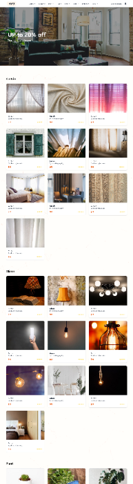
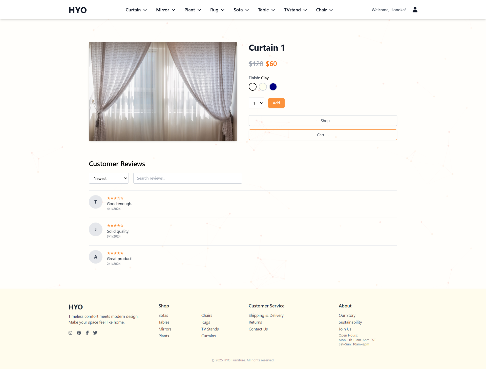
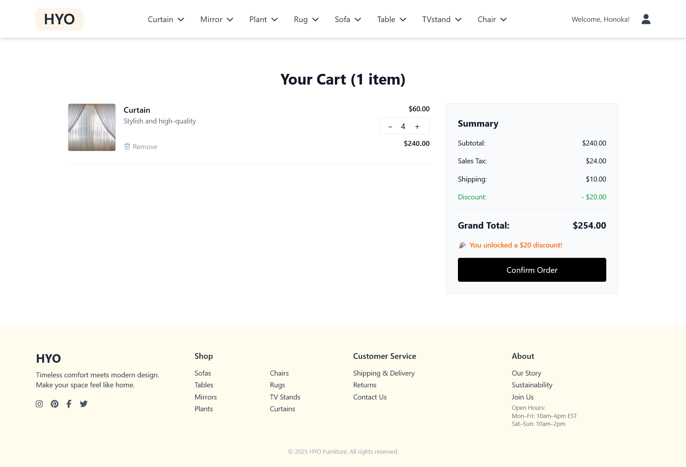
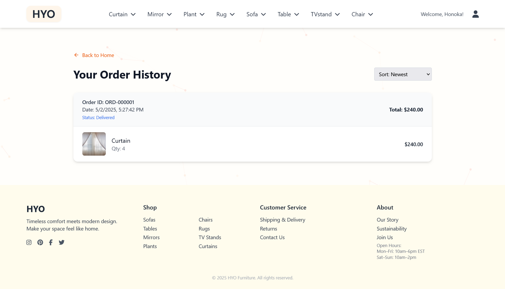
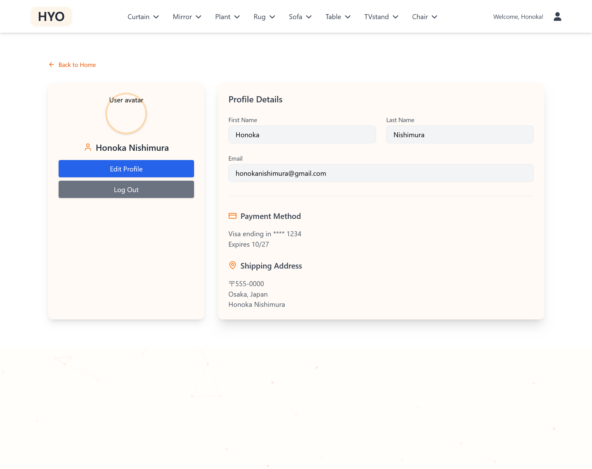
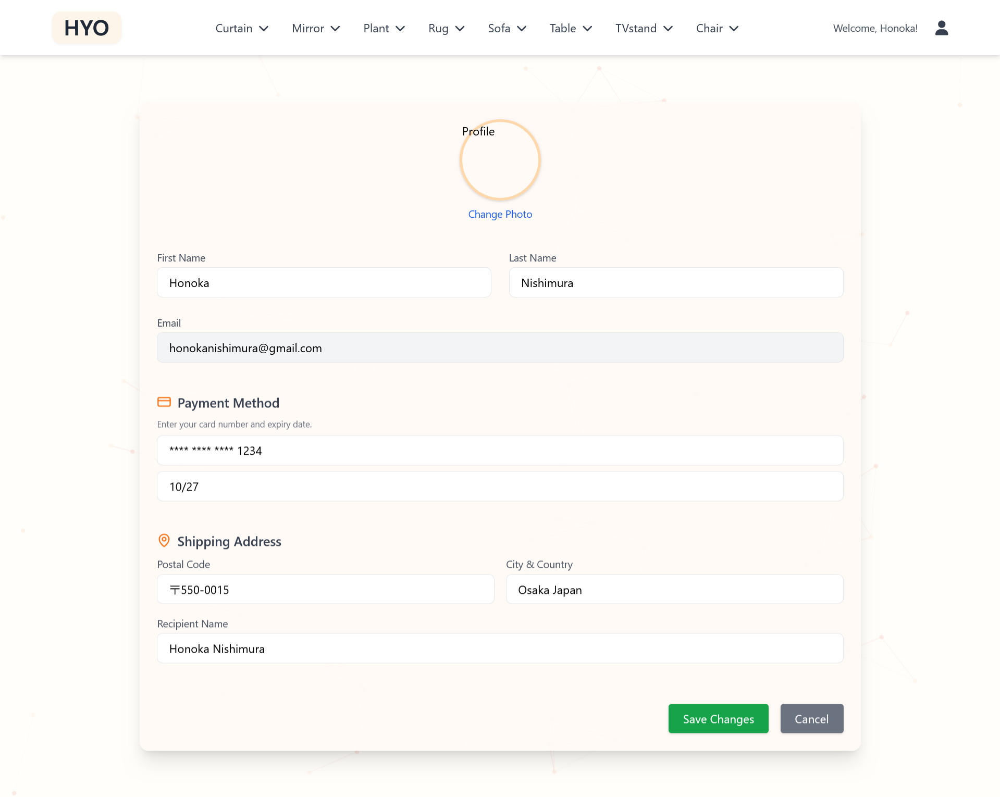
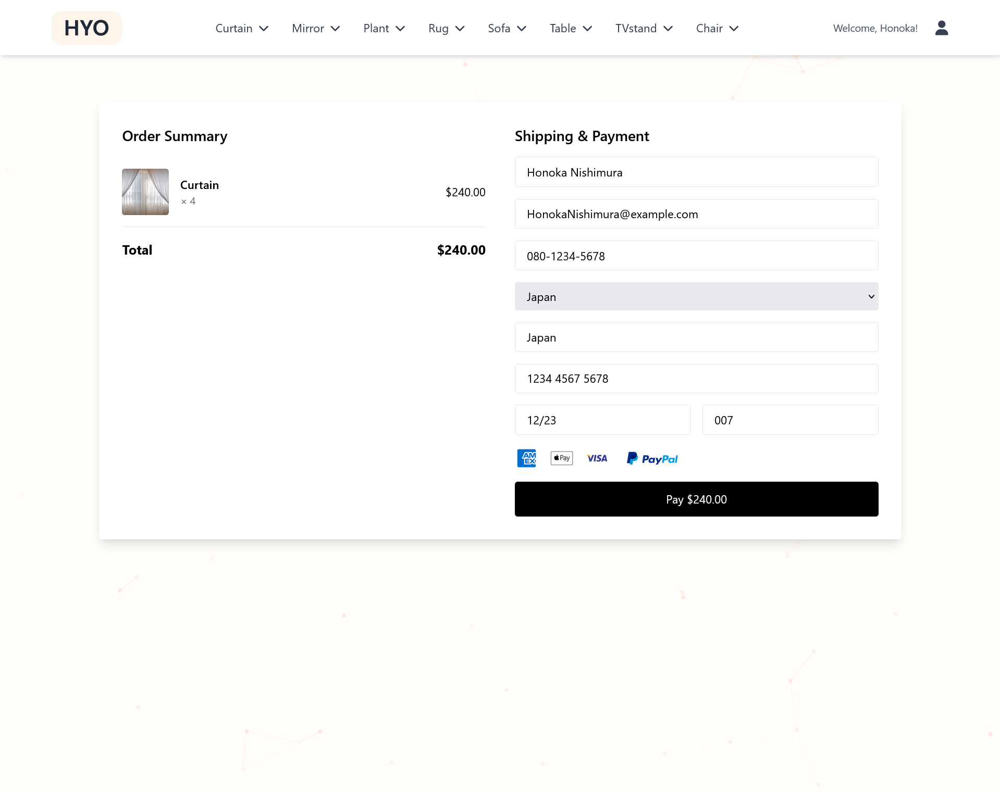

# E-Commerce UI from Simulated Client Brief

A modular shopping UI built with React and TypeScript, based on a simulated client brief.

## Live Demo

https://furniture-app.pages.dev

## Overview

Built entirely solo, this project shows my ability to plan, prioritize, and ship a real-world app independently.
It includes product browsing, cart management, user authentication, and order tracking.


## What I Focused On

- Keeping the backend lightweight and fast using Cloudflare Functions + D1
- Structuring the frontend for readability and scalability with React + TypeScript
- Ensuring a smooth, persistent experience for users across pages (auth + cart)
- Prioritizing speed, code quality, and real usability over complex features


---

## Process
**Worked consistently from design to UI/UX and feature implementation**
  
- **Cloudflare Functions** chosen for fast and scalable serverless logic
- **D1 (SQLite)** used to keep data storage light and simple for small teams
- **React Context + localStorage** handle persistent auth/cart across pages
- Realistic flow from homepage > category > product detail > cart > checkout > history
- Tailwind CSS used to style quickly with focus on responsive, accessible UI
- Prioritize simple architecture, clean, reusable components, and practical features

---

## What Makes This Unique

This project stands out for its **end-to-end solo development** and focus on startup-friendly architecture.

- Entirely solo-built — backend, frontend, logic, and design
- Realistic shopping flow with persistent user/cart data
- Typed strictly with TypeScript for better future scaling
- Designed with maintainability and simplicity in mind


## Features

- Product filtering by category
- Product detail view with selectable options
- Persistent cart using Context API
- Checkout flow with form validation
- User login, signup, and profile management
- Order history by user
- Deployed with Cloudflare Pages, Functions, and D1

## Tech Stack

| Frontend       | Backend              | Tools & Libraries            |
|----------------|----------------------|------------------------------|
| React + Vite   | Cloudflare Functions | React Router, React Hook Form |
| TypeScript     | Cloudflare D1        | Framer Motion, Tailwind CSS  |
| Tailwind CSS   | LocalStorage / Context API | JSON Server (for mock dev)    |


## Screenshots

### Top Page (Hero and Categories)


### Full Product Listing


[View full product list screenshot →](./public/screenshots/ProductAll.png)


### Product Detail and Cart
Users can customize quantity and color, then add items to cart.


### Checkout: Review Order
Final summary before completing the purchase.


### Checkout: Payment and Address Input
Secure form with validations for user shipping and billing.


### Saved Profile Information
Display of saved payment and address info for logged-in users.


### Edit Profile
Editable form to update user data.


### Payment Method Selection
Credit card and PayPal options for diverse user needs.


---

## Getting Started

```bash
git clone https://github.com/honokanishimura/typescript1.git
cd typescript1
npm install
npm run dev

To run the mock API during local development:

npx json-server --watch db.json --port 3001
